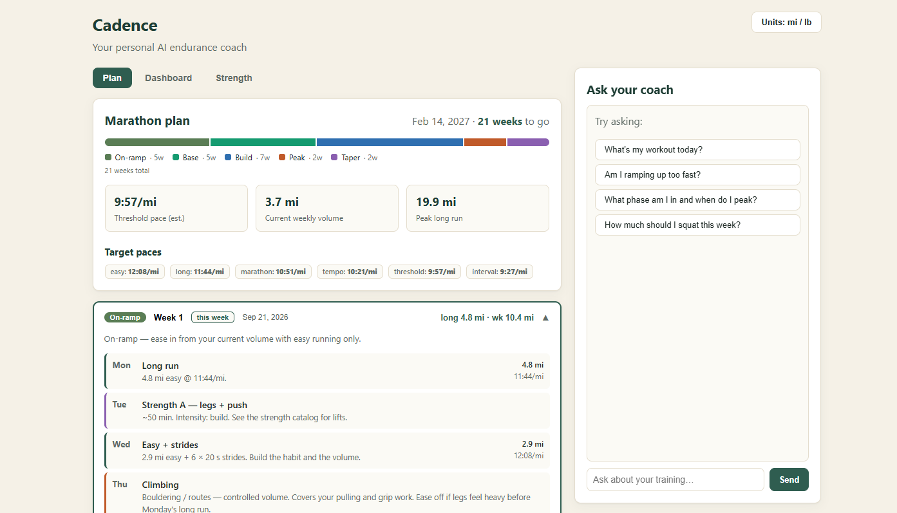
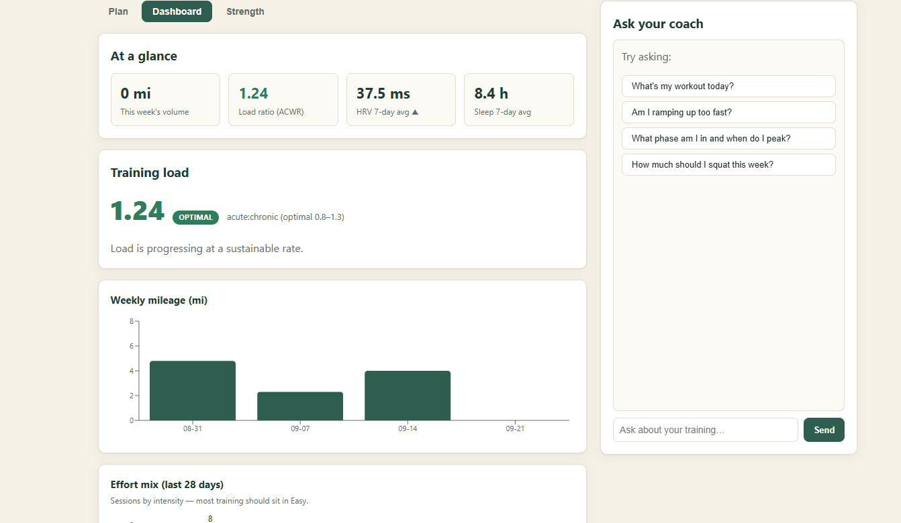
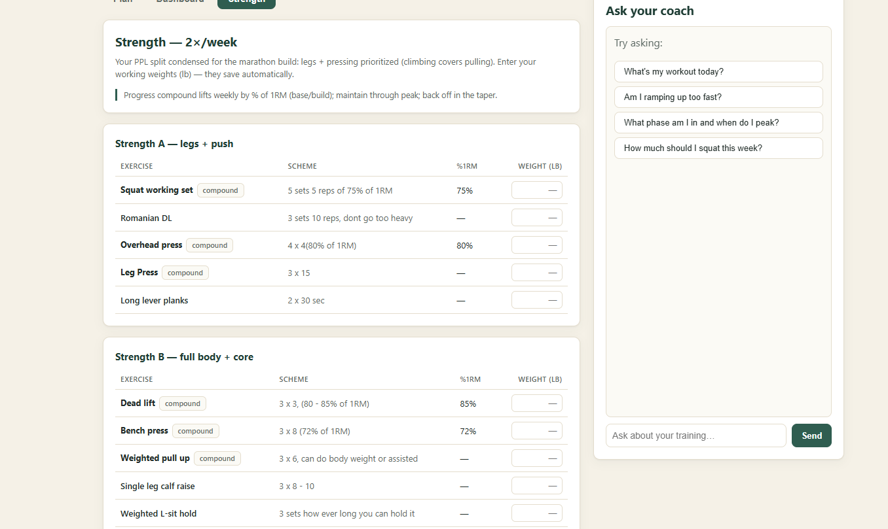
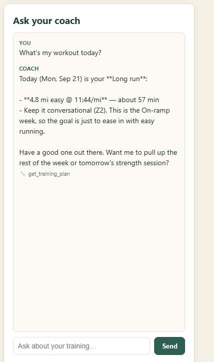

# Cadence 🏃

A personal AI endurance coach. It pulls one athlete's training data from Garmin,
visualizes it, generates a **periodized marathon plan** grounded in that data, and
lets the athlete chat with an AI coach that retrieves their numbers through tools
to answer questions and prescribe workouts.

Built as a full-stack, AI-forward project: FastAPI + React, a swappable LLM
provider (Claude / Kimi K2), an agent loop with tool use, a pure-Python
periodization engine, and an eval harness with an LLM-as-judge grader.

## Screenshots

<!-- Add images to docs/screenshots/ (see that folder's README). -->
| Plan | Dashboard |
|------|-----------|
|  |  |

| Strength | Coach |
|----------|-------|
|  |  |

## Features
- **AI coach agent** — chats with the athlete, calling tools to retrieve recent
  activities, weekly load, recovery, the training plan, and strength sessions
  before answering. The UI shows which tools each answer used.
- **Periodized marathon plan** — a Base → Build → Peak → Taper macrocycle from
  today to race day, with a day-by-day schedule (3 runs + 2 strength + climbing),
  cutback weeks, a 3-week taper, and target paces derived from the athlete's
  threshold pace. Grounded in their real current volume and fitness.
- **Dashboard** — derived metrics from the same functions the coach uses:
  acute:chronic load, weekly mileage, effort mix, and HRV/sleep trends.
- **Strength tracking** — the athlete's 6-day PPL split condensed into two
  marathon-friendly sessions, with working weights that persist (SQLite).
- **Metric / imperial toggle** — the whole UI and the coach switch units; data is
  stored canonical (metric) and converted only at the display edge.
- **No-break demos** — reads live Garmin data when available, sample data
  otherwise, so the app always runs.

## Tech stack
Python · FastAPI · SQLite · React · Vite · recharts · Anthropic SDK · garminconnect

## Architecture
- **backend/** — FastAPI.
  - `models/llm_provider.py` — swappable model layer (`LLM_PROVIDER` picks Claude
    or Kimi K2); everything calls `llm_provider.chat(...)`.
  - `agent/` — the coach agent loop (`coach_agent.py`) and its tools (`tools.py`).
  - `analytics/` — **pure functions** (no I/O): `training_metrics.py` (zones,
    trends, PRs, acute:chronic load, recovery), `plan.py` (the periodization
    engine), `units.py` (conversions). Unit-tested with plain asserts.
  - `data/` — `garmin_source.py` (live-or-sample data layer), `garmin_mapper.py`
    (maps live Garmin into the app schema), `db.py` (SQLite: strength weights +
    workout log), `strength_catalog.json` (imported from the athlete's plan).
  - `plan_service.py` — wires the pure plan engine to live athlete data.
- **frontend/** — React + Vite. Tabbed UI (Plan / Dashboard / Strength) with the
  coach panel always alongside.
- **evals/** — eval harness (`eval_cases.json` + `run_evals.py`) with an
  LLM-as-judge grader.

The dashboard and the coach's tools call the **same** analytics functions, so a
number on a chart and a number the coach quotes can never drift apart.

## Setup (one time)

**Backend**
```bash
cd backend
python -m venv .venv
.\.venv\Scripts\Activate.ps1      # Windows PowerShell
# source .venv/bin/activate       # macOS / Linux
pip install -r requirements.txt
cp .env.example .env              # then edit .env and add your ANTHROPIC_API_KEY
```

**Frontend**
```bash
cd frontend
npm install
```

## Running it

Two processes. From the repo root you can start both at once:
```bash
npm install        # installs 'concurrently' once
npm run dev        # runs backend (:8000) and frontend (:5173) together
```

Or run them separately, backend first:

**Terminal 1 — backend**
```bash
cd backend
.\.venv\Scripts\Activate.ps1      # source .venv/bin/activate on mac/linux
uvicorn main:app --reload --port 8000
```

**Terminal 2 — frontend**
```bash
cd frontend
npm run dev
```

Then open **http://localhost:5173**.

- Health check: **http://localhost:8000/api/health** returns
  `{"status":"ok","provider":"claude","model":"..."}`.
- First load can be slow when `USE_LIVE_GARMIN=true` — it's doing the live Garmin
  pull (cached 15 min). If Garmin throttles, it falls back to sample data.
- No Node? The backend runs on its own; hit the API directly (`/api/plan`,
  `/api/metrics`, `/api/coach`, ...).

## The training plan
`analytics/plan.py` is a pure engine: given a start date, race date, race
distance, and the athlete's threshold pace + recent volume, it lays out the full
macrocycle and every day's workout. Scheduling (long-run day, strength days, etc.)
is config-driven in `data/plan_config.json`. The athlete's 6-day strength plan is
imported once into `data/strength_catalog.json`:
```bash
cd backend
python -m scripts.import_strength "path/to/Push, Pull, Legs.xlsx"
```

## Evals
```bash
# from repo root, backend deps installed and ANTHROPIC_API_KEY in backend/.env
python -m evals.run_evals            # deterministic checks (keyword + tool use)
python -m evals.run_evals --judge    # + LLM-as-judge scoring against a rubric
```
Evals always run against the bundled sample data, so results are reproducible
regardless of your `.env` Garmin setting.

## Tests
Pure-function unit tests (no pytest needed):
```bash
cd backend
python -m analytics.test_units
python -m analytics.test_plan
```

## Notes
- Garmin access uses the unofficial `garminconnect` wrapper (personal login) —
  fine for a personal prototype. Leave `USE_LIVE_GARMIN=false` to run on sample
  data with zero setup.
- Secrets live in `.env` (gitignored); the SQLite database (`*.db`) is local and
  gitignored too.
